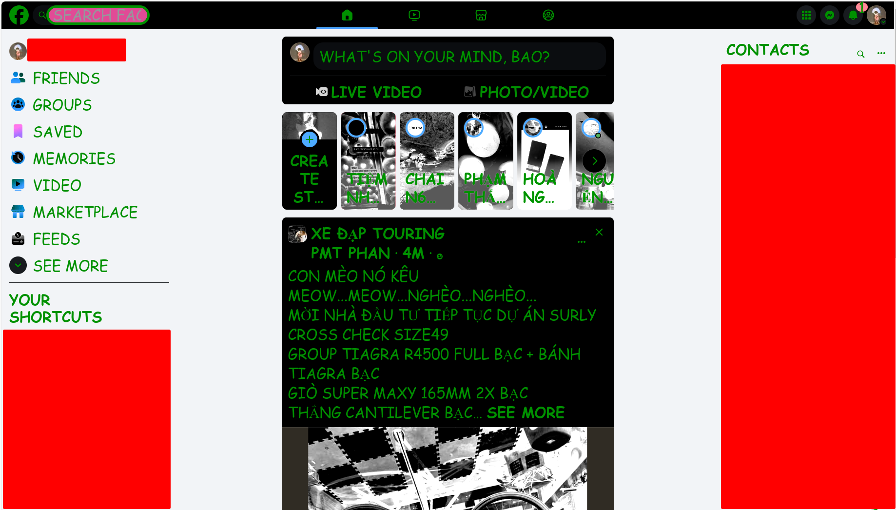
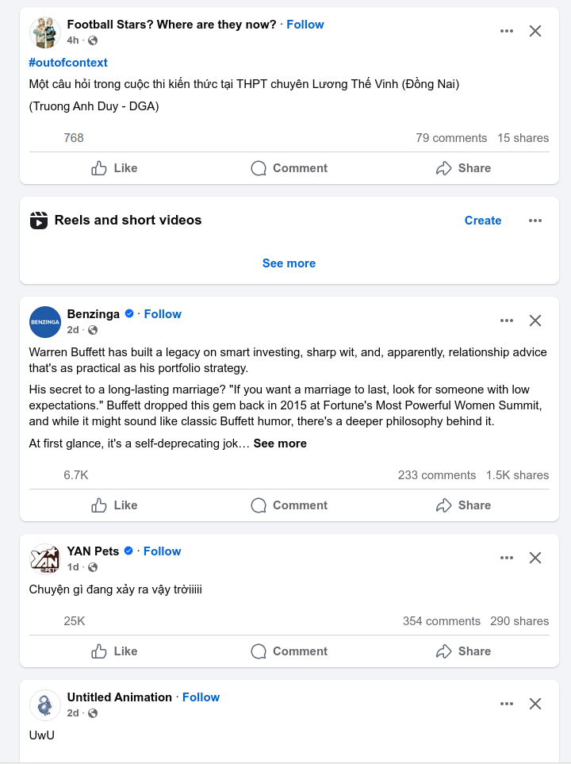
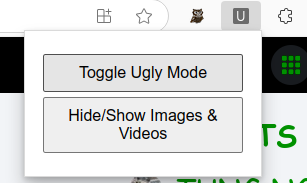

# Ugly Facebook Chrome Extension

## Overview
This Chrome extension makes Facebook look extremely ugly by injecting custom CSS. It also includes a toggle button to enable or disable the modifications.





## Features
- Injects custom CSS to distort Facebook's appearance.
- Toggle button to turn Ugly Mode on/off.
- Option to hide/show images and videos.



## Installation
1. Download or clone this repository.
2. Open `chrome://extensions/` in your Chrome browser.
3. Enable **Developer mode** (top right corner).
4. Click **Load unpacked** and select the extension folder.
5. The extension is now installed and ready to use!

## How It Works
- The extension injects `ugly.css` into Facebook when the page loads.
- Clicking the **Toggle Ugly Mode** button applies or removes the ugly styles.
- Uses `chrome.scripting.insertCSS` and a content script for dynamic changes.

## Usage
1. Open **Facebook** in Chrome.
2. Click the extension icon and select **Toggle Ugly Mode**.
3. (Optional) Use the **Hide/Show Images** button to control media visibility.

## Troubleshooting
- **CSS Not Applying?** Try reloading Facebook or restarting Chrome.
- **Toggle Button Not Working?** Open the Chrome DevTools (`F12`) > Console and check for errors.
- **Facebook Blocking Scripts?** Some sites use Content Security Policy (CSP) to block script injection. If this happens, you may need to adjust permissions or use `chrome.scripting.executeScript` instead.

## Development
### File Structure
```
UglyFacebook/
│── manifest.json        # Chrome extension manifest
│── popup.html           # UI for popup
│── popup.js             # JavaScript for popup functionality
│── background.js        # Handles script injection
│── content-script.js    # Modifies Facebook's styles dynamically
│── ugly.css             # Ugly CSS styles
│── icons/               # Extension icons
```
### Debugging
1. Open `chrome://extensions/`.
2. Find **Ugly Facebook** and click **Inspect views: background page**.
3. Check **Console logs** for errors.

## Future Improvements
- Add more CSS chaos (random animations, fonts, colors, etc.).
- Improve hiding/showing media elements.
- Add a settings page for customization.

## License
This project is open-source under the MIT License.